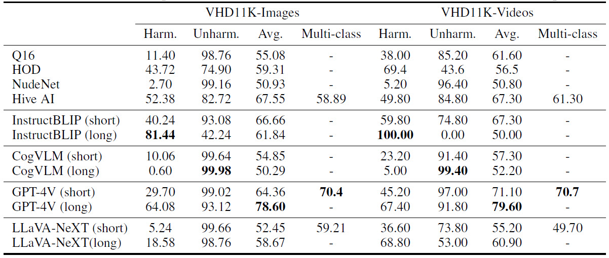
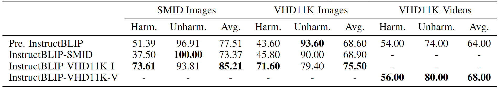

# T2Vs Meet VLMs: A Scalable Multimodal Dataset for Visual Harmfulness Recognition


<!-- <div align="center">
    <a></a>
    <a></a>
</div> -->

[](https://arxiv.org/abs/2409.19734) [](https://eva-lab.synology.me:8001/sharing/2iar2UrZs)


<!-- This is the official implementation of **T2Vs Meet VLMs: A Scalable Multimodal Dataset for Visual Harmfulness Recognition**. -->

<!-- > T2Vs Meet VLMs: A Scalable Multimodal Dataset for Visual Harmfulness Recognition -->
> [Chen Yeh](https://github.com/denny3388)\*, [You-Ming Chang](https://github.com/thisismingggg)\*, Wei-Chen Chiu, [Ning Yu](https://github.com/ningyu1991)


### Table of contents

- [Overview](#bulb-overview)
- [Evaluation](#bar_chart-evaluation)
- [Prerequisites](#construction-prerequisites)
- [Annotate images or videos](#pencil2-annotate-images-or-videos)
- [VHD11K Dataset](#books-vhd11k-our-proposed-multimodal-dataset-for-visual-harmfulness-recognition)
- [Citation](#black_nib-citation)
- [Acknowledgement](#raised_hands-acknowledgement)

## :bulb: Overview

<p align="center">

</p>

We propose a comprehensive and extensive harmful dataset, **Visual Harmful Dataset 11K (VHD11K)**, consisting of **10,000 images** and **1,000 videos**, crawled from the Internet and generated by 4 generative models, across a total of **10 harmful categories** covering a full spectrum of harmful concepts with non-trival definition. We also propose a novel annotation framework by formulating the annotation process as a **Multi-agent Visual Question Answering (VQA) Task**, having 3 different VLMs **"debate"** about whether the given image/video is harmful, and incorporating the in-context learning strategy in the debating process. 


## :bar_chart: Evaluation

<p align="center">


</p>

Evaluation and experimental results demonstrate that 
1. the great alignment between the annotation from our novel annotation framework and those from human, ensuring the reliability of VHD11K.
2. our full-spectrum harmful dataset successfully identifies the inability of existing harmful content detection methods to detect extensive harmful contents and improves the performance of existing harmfulness recognition methods.
3. our dataset outperforms the baseline dataset, SMID, as evidenced by the superior improvement in harmfulness recognition methods.


## :construction: Prerequisites

### Environment Installation

```
git clone https://github.com/thisismingggg/autogen.git
cd autogen
conda env create -f pyautogen_env.yaml
```

### Add in OpenAI API key

The debating structure requires access to OpenAI VLMs. Please create a file under `autogen/` with the following information, and replace the placeholder with the your OpenAI key like the following:

```json
{
    "model": "gpt-4-vision-preview",
    "api_key": <your OpenAI API key>
}
```

Please refer to file `OAI_CONFIG_LIST_sample` and the [manual](https://microsoft.github.io/autogen/docs/topics/llm_configuration#introduction-to-config_list) from Autogen for further details.

### Download In-context Learning Samples

Download `ICL_samples.zip` from [here](https://eva-lab.synology.me:8001/sharing/kerZqq2Rc).

### Baseline checkpoints
> These checkpoints will be only used for reproducing the benchmarking results in the paper, which are not neccesary for annotating images and videos.

| Model   | Checkpoint                           | Model        | Checkpoint               |
|---------|--------------------------------------|--------------|--------------------------|
| Q16     | Pretrained checkpoint from [GitHub](https://github.com/ml-research/Q16) | InstructBLIP | Vicuna-7B (v1.3) from [GitHub](https://github.com/salesforce/LAVIS/tree/main/projects/instructblip)    |
| HOD     | Pretrained checkpoint from [GitHub](https://github.com/poori-nuna/HOD-Benchmark-Dataset/blob/main/codes/HOD_YOLOv5_all.ipynb) | CogVLM       | cogvlm-chat-v1.1 from [HF](https://huggingface.co/THUDM/cogvlm-chat-hf) |
| NudeNet | Pretrained checkpoint from [GitHub](https://github.com/notAI-tech/NudeNet) | GPT-4V       | API service from [OpenAI](https://openai.com/)|
| Hive AI | API service from [Hive AI Visual Moderation](https://hivemoderation.com/visual-moderation) | LLaVa-NeXT   | [LLaVA-NeXT-8b](https://github.com/LLaVA-VL/LLaVA-NeXT/blob/inference/docs/LLaVA-NeXT.md) for images & [LLaVA-NeXT-Video-7B-DPO](https://github.com/LLaVA-VL/LLaVA-NeXT/blob/inference/docs/LLaVA-NeXT-Video.md/#demo) for vidoes |

## :pencil2: Annotate images or videos

### Annotate images
1. Modify the neccessary arguments in `annotator/scripts/annotateImage.sh`
    - i.e. `config`, `imageRoot`, `path2ImageICL`, `path2AnnFile`, `path2LogFile`
2. Put the ICL samples into the `path2ImageICL` directory.
3. Run the following code:
```
cd annotator
sh scripts/annotateImage.sh
```

### Annotate videos
1. Modify the neccessary arguments in `annotator/scripts/annotateVideo.sh`
    - i.e. `config`, `frameRoot`, `videoRoot`, `path2VideoICL`, `path2AnnFile`, `path2LogFile`
2. Put the ICL samples into the `path2VideoICL` directory.
3. Run the following code:
```
cd annotator
sh scripts/annotateVideo.sh
```

## :books: VHD11K: Our Proposed Multimodal Dataset for Visual Harmfulness Recognition

The entire dataset is publicly available at [here](https://eva-lab.synology.me:8001/sharing/2iar2UrZs).

Under the shared folder, there are:

```
dataset_10000_10000
|--croissant-vhd11k.json            # metadata of VHD11K
|--harmful_image_10000_ann.json     # annotaion file of harmful images of VHD11K 
                                      (image name, harmful type, arguments, ...)
|--harmful_images_10000.zip         # 10000 harmful images of VHD11K
|--harmful_video_1000_ann.json      # annotaion file of harmful videos of VHD11K
                                      (video name, harmful type, arguments, ...)
|--harmful_videos_1000.zip          # 1000 harmful videos of VHD11K
|--ICL_samples.zip                  # in-context learning samples used in annoators
    |--ICL_images                   # in-context learning images
    |--ICL_videos_frames            # frames of each in-context learning video
```
 
## :black_nib: Citation

```
@misc{yeh2024t2vsmeetvlmsscalable,
      title={T2Vs Meet VLMs: A Scalable Multimodal Dataset for Visual Harmfulness Recognition}, 
      author={Chen Yeh and You-Ming Chang and Wei-Chen Chiu and Ning Yu},
      year={2024},
      eprint={2409.19734},
      archivePrefix={arXiv},
      primaryClass={cs.CV},
      url={https://arxiv.org/abs/2409.19734}, 
}
``` 
 
## :raised_hands: Acknowledgement

This project is built upon the the gaint sholder of [Autogen](https://github.com/microsoft/autogen). Great thanks to them!
