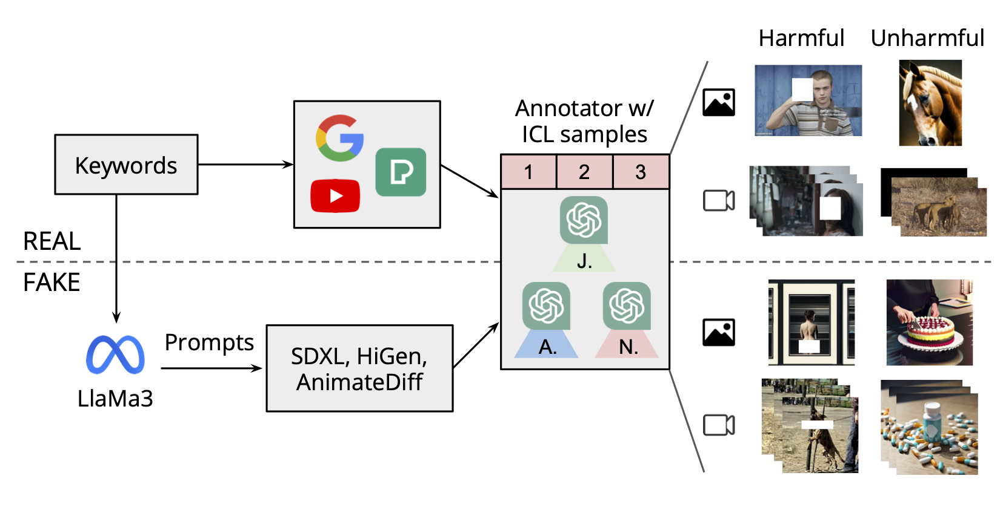

# T2Vs Meet VLMs: A Scalable Multimodal Dataset for Visual Harmfulness Recognition

<!-- <div align="center">
    <a></a>
    <a></a>
</div> -->

This is the official implementation of **T2Vs Meet VLMs: A Scalable Multimodal Dataset for Visual Harmfulness Recognition** [[paper]()].

## Introduction

While widespread access to the Internet and the rapid advancement of generative models boost people's creativity and productivity, the risk of encountering inappropriate or harmful content also increases. To address the aforementioned issue, researchers managed to incorporate several harmful contents datasets with machine learning methods to detect harmful concepts. However, existing harmful datasets are curated by the presence of a narrow range of harmful objects, and only cover real harmful content sources. This restricts the generalizability of methods based on such datasets and leads to the potential misjudgment in certain cases. Therefore, we propose a comprehensive and extensive harmful dataset, **VHD11K**, consisting of 10,000 images and 1,000 videos, crawled from the Internet and generated by 4 generative models, across a total of 10 harmful categories covering a full spectrum of harmful concepts with non-trival definition. We also propose a novel annotation framework by formulating the annotation process as a multi-agent Visual Question Answering (VQA) task, having 3 different VLMs "debate" about whether the given image/video is harmful, and incorporating the in-context learning strategy in the debating process. Therefore, we can ensure that the VLMs consider the context of the given image/video and both sides of the arguments thoroughly before making decisions, further reducing the likelihood of misjudgments in edge cases. Evaluation and experimental results demonstrate that 
(1) the great alignment between the annotation from our novel annotation framework and those from human, ensuring the reliability of VHD11K;
(2) our full-spectrum harmful dataset successfully identifies the inability of existing harmful content detection methods to detect extensive harmful contents and improves the performance of existing harmfulness recognition methods;
(3) our dataset outperforms the baseline dataset, SMID, as evidenced by the superior improvement in harmfulness recognition methods.
The entire dataset is publicly available at [here](https://eva-lab.synology.me:8001/sharing/2iar2UrZs).

<p align="center">

</p>

## Prerequisites

### Environment Installation

```
git clone https://github.com/nctu-eva-lab/VHD11K.git
cd VHD11K
conda env create -f pyautogen_env.yaml
```

### Add in OpenAI API key

The debating structure requires access to OpenAI VLMs. Please create a file under `VHD11K/` with the following information, and replace the placeholder with the your OpenAI key like the following:

```json
{
    "model": "gpt-4-vision-preview",
    "api_key": <your OpenAI API key>
}
```

Please refer to file `OAI_CONFIG_LIST_sample` and the [manual](https://microsoft.github.io/autogen/docs/topics/llm_configuration#introduction-to-config_list) from Autogen for further details.

### Download In-context Learning Samples

Download `ICL_samples.zip` from [here](https://eva-lab.synology.me:8001/sharing/kerZqq2Rc).

### Run Inference

- Use `annotator/scripts/annotateImage.sh` or `annotator/scripts/annotateVideo.sh` according your requirements.
- Replace `config`, `path2ImageICL`, and `imageRoot` in the script.
- Run script by `bash annotator/scripts/annotateImage.sh` or `bash annotator/scripts/annotateVideo.sh`.

## VHD11K: Our Proposed Multimodal Dataset for Visual Harmfulness Recognition

The entire dataset is publicly available at [here](https://eva-lab.synology.me:8001/sharing/2iar2UrZs).

Under the shared folder, there are:

```
dataset_10000_10000
|--croissant-vhd11k.json            # metadata of VHD11K
|--harmful_image_10000_ann.json     # annotaion file of harmful images of VHD11K 
                                      (image name, harmful type, arguments, ...)
|--harmful_images_10000.zip         # 10000 harmful images of VHD11K
|--harmful_video_1000_ann.json      # annotaion file of harmful videos of VHD11K
                                      (video name, harmful type, arguments, ...)
|--harmful_videos_1000.zip          # 1000 harmful videos of VHD11K
|--ICL_samples.zip                  # in-context learning samples used in annoators
    |--ICL_images                   # in-context learning images
    |--ICL_videos_frames            # frames of each in-context learning video
```
 
## Citation
 
 
## Acknowledgement

This project is built upon the the gaint sholder of [Autogen](https://github.com/microsoft/autogen). Great thanks to them!